# Glidepath

**Version 2.33** &nbsp;·&nbsp; April 2026 &nbsp;·&nbsp; Prepared for CMSgts, 1C7 Career Field

---

## The Problem You Already Know

You've sat through the briefs. You've read the AAR from the October 2025 C2IMERA Working Group. You know what the memo says — because you probably nodded along to it:

> "Current AM operations are hampered by fragmented tools (Excel, SharePoint, etc.), manual workflows, and varying data practices, hindering situational awareness and operational efficiency."

That's a polite way of saying every AM shop in the force runs on a different stack of shortcuts. One base keeps the discrepancy log on a shared drive in an Excel workbook named `AirfieldDiscs_FINAL_v4_USE_THIS_ONE.xlsx`. The next base keeps it on a whiteboard in AMOPS. A third base actually uses C2IMERA, but only the Duty Officer knows how, and the inputs are three hours stale because nobody entered the last two runway status changes.

When an MSgt PCSs out, that local knowledge walks with them. The new TSgt inherits a Visio diagram from 2019, a binder of SOPs half of which contradict the current DAFMAN, and the same whiteboard.

Every MAJCOM Functional Manager on your working group knows this already. The AAR identified nine baseline functional requirements (PPRs, Parking/MOG, Discrepancies, Traffic Logs, Checklists, Standardized Reporting Conditions, Additional Airfield Layers, Crash Grid Overlay, Snow Ops). Phase 1 of the implementation plan — 0 to 6 months — is literally *"mandate usage of existing C2IMERA features via Guidance Memorandum."*

Mandating usage is not the same as solving the problem. If the tool were easy to use, shops would already be using it. The AAR called out the root cause in its own Key Insights section: *"Change management and overcoming user resistance are critical for success."*

**Glidepath is what that solution looks like when it's designed by the AM shop, for the AM shop.**

---

## What Glidepath Is, in One Paragraph

Glidepath is a Progressive Web App built specifically for Airfield Management. It replaces the Excel-and-whiteboard stack that every shop quietly runs on with a single, real-time platform accessible from any browser on any device. Runway status, NAVAID outages, discrepancies, inspections, PPRs, wildlife sightings, parking plans, waivers, NOTAMs, QRCs, shift checklists, ACSI — all in one place, all time-stamped in Zulu, all auditable. It is operational today at Selfridge ANG Base and available for evaluation at any interested installation. There is no install, no VPN, no CAC — just a browser URL and an invited account.

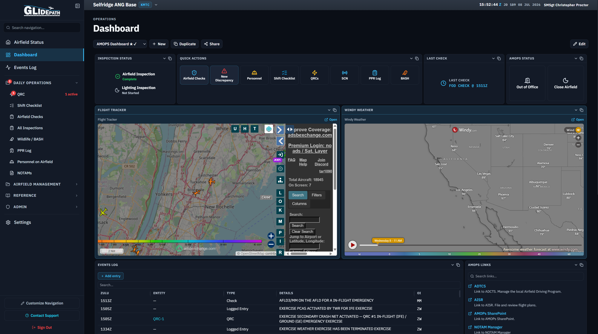

---

## Table of Contents

1. [How Glidepath Maps to the Nine C2IMERA Baseline Requirements](#1-how-glidepath-maps-to-the-nine-c2imera-baseline-requirements)
2. [The Airfield Status Board (Standardized Conditions Ready)](#2-the-airfield-status-board)
3. [Discrepancies & CES Work Orders — The End of the Spreadsheet](#3-discrepancies--ces-work-orders)
4. [Visual NAVAIDs with DAFMAN Table A3.1 Outage Engine](#4-visual-navaids-with-dafman-table-a31-outage-engine)
5. [Aircraft Parking & MOG Management](#5-aircraft-parking--mog-management)
6. [Prior Permission Required (PPR) Log](#6-prior-permission-required-ppr-log)
7. [Quick Reaction Checklists — 25 QRCs, 8 Step Types](#7-quick-reaction-checklists)
8. [Airfield Checks & Daily Inspections](#8-airfield-checks--daily-inspections)
9. [ACSI Annual Compliance Inspection](#9-acsi-annual-compliance-inspection)
10. [Wildlife / BASH](#10-wildlife--bash)
11. [Obstruction Evaluations (UFC 3-260-01)](#11-obstruction-evaluations)
12. [Waivers (AF Form 505)](#12-waivers)
13. [NOTAM Tracking](#13-notam-tracking)
14. [Shift Checklist & Events Log](#14-shift-checklist--events-log)
15. [Reports & Analytics](#15-reports--analytics)
16. [Multi-Base & Multi-Role](#16-multi-base--multi-role)
17. [Glidepath vs. C2IMERA](#17-glidepath-vs-c2imera)
18. [Conservative Time-Savings Estimates](#18-conservative-time-savings-estimates)
19. [Regulatory Alignment](#19-regulatory-alignment)
20. [How to Evaluate Glidepath](#20-how-to-evaluate-glidepath)

---

## 1. How Glidepath Maps to the Nine C2IMERA Baseline Requirements

The October 2025 Working Group identified nine baseline functional requirements. Glidepath implements eight of them today, in production, and has a clear path for the ninth.

| # | Baseline Requirement | Glidepath Status | Module |
|---|---|---|---|
| 1 | **Prior Permission Required (PPR)** | ✅ Production | PPR Log with PDF export |
| 2 | **Aircraft Parking Plan & MOG** | ✅ Production | Drag-and-drop parking with to-scale silhouettes |
| 3 | **Airfield Discrepancies** | ✅ Production | Full workflow w/ CES Work Order integration |
| 4 | **Aircraft Traffic Logs** | ⏳ On roadmap | Integration with AMC sortie data planned |
| 5 | **Checklists** | ✅ Production | 25 QRCs, Shift Checklist, ACSI, inspection templates |
| 6 | **Standardized Airfield Reporting Conditions** | ✅ Production | Runway/RSC/RCR/BWC/NAVAID/ARFF — all color-coded per the AM Standardized Conditions Draft |
| 7 | **Additional Airfield Layers** | ✅ Production | Imaginary Surfaces, Obstructions, Waivers, Visual NAVAIDs, all as map overlays |
| 8 | **Crash Grid Map Overlay** | ⏳ Roadmap | Base setup ingest of CE-produced KML planned |
| 9 | **Snow Operations Management** | ✅ Partial | RCR/RSC tracking via Airfield Checks; snow-ops module scoped |

The gaps (#4 Traffic Logs, #8 Crash Grid, parts of #9) are known and scoped. Everything else is usable today.

---

## 2. The Airfield Status Board

The Airfield Status page is the operational heart of Glidepath and directly implements the *Standardized Conditions* framework that AFFSA and ACC have drafted. Every mandatory condition from the 1C7 working group is represented: Airfield Status, Active Runway, Runway Status, RSC, RCR, BWC, NAVAIDs, Airfield Lighting, ARFF. Each is color-coded exactly as specified in the standardized conditions draft.

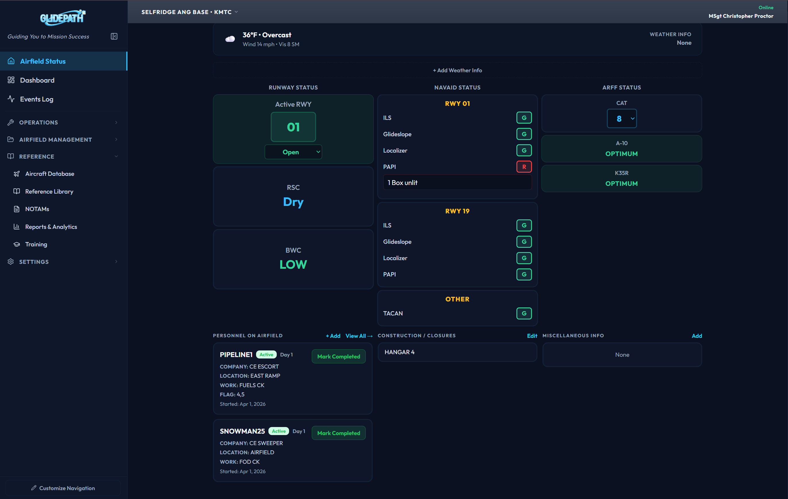

**Why it matters:** If HAF/A3OJ and AFFSA publish the Standardized Conditions Guidance Memorandum tomorrow, a Glidepath installation is already compliant. No reconfiguration. No training the shop on where RCR goes. It's already there, in the right color, with the right label, per the draft.

**Real-time to every device.** A status change posted by the AMOPS MSgt shows up on the Airfield Manager's phone, the command post's wall display, and the deployed AEF team's laptop in under a second — no refresh, no polling. This is the "common operating picture" C2IMERA wants, without waiting 24 months for Phase 2.

**AFM Out of Office banner.** The AFM flips a toggle, leaves Command Post initials as the relief authority, and the banner shows across the status page with a message like "AFM 1500Z–1900Z, direct calls to AMOPS SSgt Smith." Activation and deactivation are logged to the Events Log with attribution. No more "nobody told me the AFM was at the dentist."

---

## 3. Discrepancies & CES Work Orders

This is where spreadsheets go to die. Every AM shop has a discrepancy tracking spreadsheet. Nobody likes it. Field inspectors can't update it from the flight line. CE can't see it. The wing has to request a screenshot by email.

Glidepath replaces it with a real workflow:

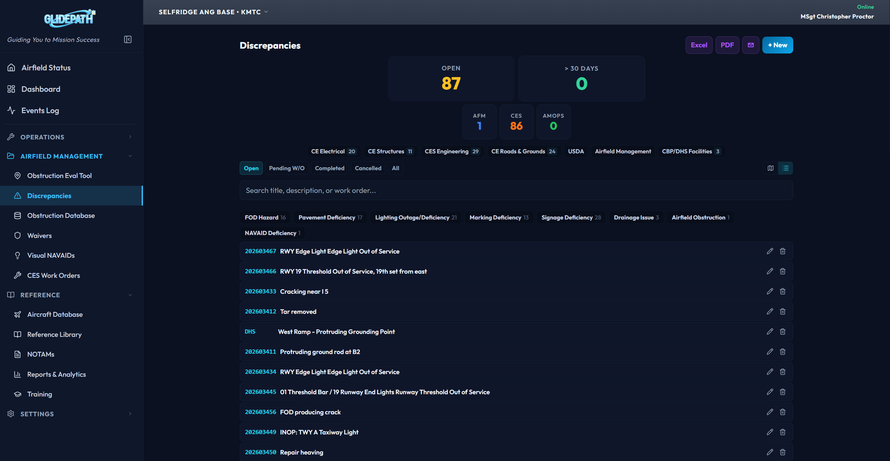

**From the flight line:** the inspector tags the discrepancy on the map, photographs it with their phone, auto-captures GPS, and files it. Location is accurate to the meter.

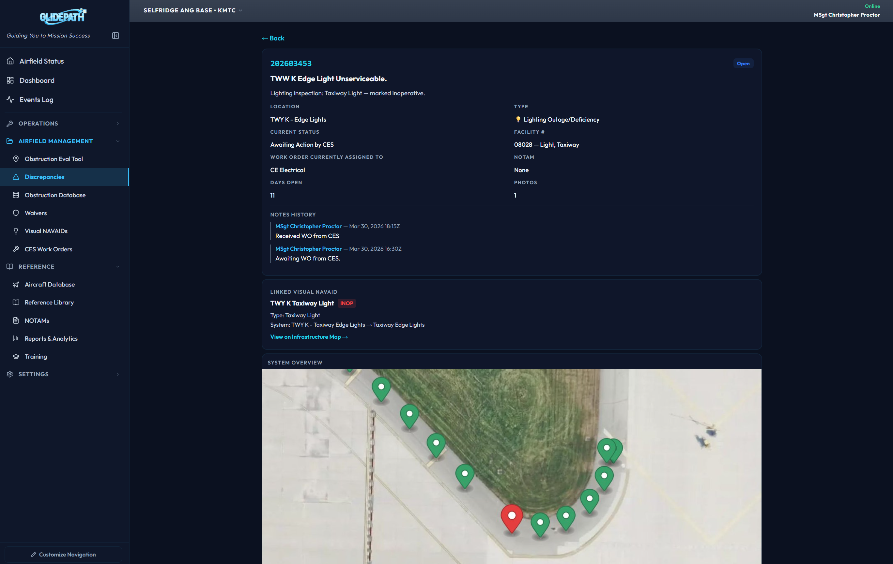

**CES handoff:** the shop that owns the fix (Pavements, Electrical, Structures, HVAC, Grounds) is auto-assigned based on the discrepancy type. CES has a dedicated role — they see only discrepancies assigned to them, and their status changes (In Work, Project, Work Completed) are signed-off with name and Zulu timestamp. No "who updated this?" phone calls.

**PDF exports** are configurable. Open-discrepancy list, aging report, individual discrepancy with photos — all generated client-side, no third-party data leaves the app. Emailable from within the app via branded transactional mail.

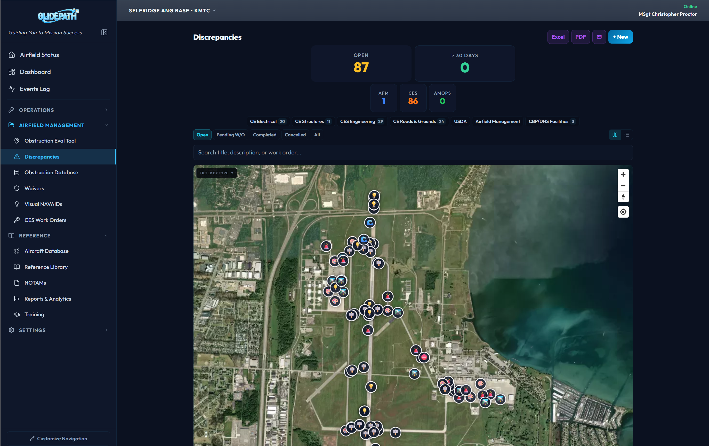

---

## 4. Visual NAVAIDs with DAFMAN Table A3.1 Outage Engine

This is the module that will convince a skeptical CMSgt that this product is serious.

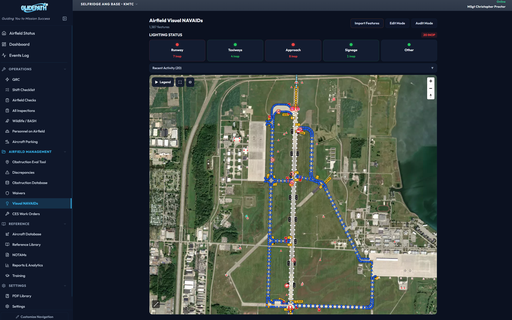

Every visual NAVAID at the base — every runway edge light, every centerline light, every PAPI, every REIL, every sign — is captured as a feature on the map with a fixture ID, a system, a component, and a bar group. The database knows that Runway 01 High-Intensity Runway Lights (HIRL) has 124 fixtures grouped into 31 bars of 4 lights each.

When an inspector marks 3 fixtures inoperative, the system calculates — in real time, against **DAFMAN 13-204 Volume 2, Table A3.1** — whether the runway is still available, approaching the allowable outage limit, or over. It checks all four threshold types: percentage, count, consecutive, and adjacent. It detects bar-outs. It flags NOTAM requirements. It knows which failures require TERPS notification and which require system shutoff.

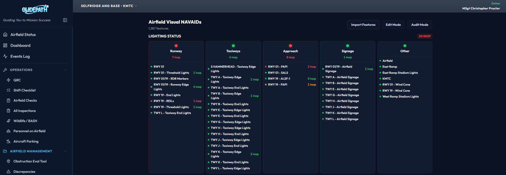

**The outage engine turns a 40-page table into 4-tier alerts:**

- 🟢 Green — Operational
- 🟡 Yellow — Approaching threshold
- 🔴 Red — Threshold exceeded, action required
- ⚫ Black — System inoperative

A field-qualified MSgt will spend 20 minutes cross-referencing Table A3.1 for a single outage decision. The engine does it in milliseconds, cites the rule, and logs the analysis. When you mark a fixture inoperative, Glidepath automatically drafts a discrepancy with the right structure (status, component, location, DAFMAN bar-out note). When it's repaired, it offers to close the linked discrepancy with user attribution and a Zulu timestamp.

There is no other airfield management tool in the force that does this today.

---

## 5. Aircraft Parking & MOG Management

The AAR's description of current MOG management was painfully honest: *"Managing aircraft parking feels like working with blocks."*

Glidepath's parking module is a to-scale SVG-rendered parking plan where every aircraft silhouette is geometrically correct for the tail number. Wingtip clearances are calculated live against UFC 3-260-01 taxilane envelopes. Obstacles are drawable. Taxilanes are editable down to individual points.

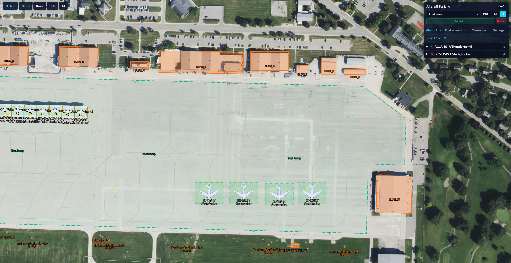

Multi-select an aircraft group, drag them as a formation, snap to grid, or free-place. MOG count updates automatically. When the deployment briefer asks "can we fit 4 C-17s and 2 KC-135s?", the answer is visible on the screen in 30 seconds.

**Every parking plan is exportable to PDF** with a map capture, an aircraft list, and UFC clearance validation notes. Shareable with the receiving unit before wheels down.

---

## 6. Prior Permission Required (PPR) Log

Every PPR request, approval, denial, and arrival/departure is logged, signed, and stored. The aircraft type, tail number, requester, UIC, POC, ETA/ETD, and remarks are captured at submit. Approval or denial by the AFM is signed with user attribution.

When a PPR aircraft arrives, the log shows arrival time. When it departs, the log shows departure. PDF export for the daily ops report pulls the PPR roster directly.

This is exactly the requirement the working group prioritized as **#1**. It works today.

---

## 7. Quick Reaction Checklists

25 QRCs. 8 step types (checkbox, checkbox with note, notify agencies, fill field, time field, conditional, text, textarea). Annual review tracking per QRC. Secondary Crash Net verbiage auto-logged for emergency QRCs. Full PDF export with completed step responses, signatures, and timestamps.

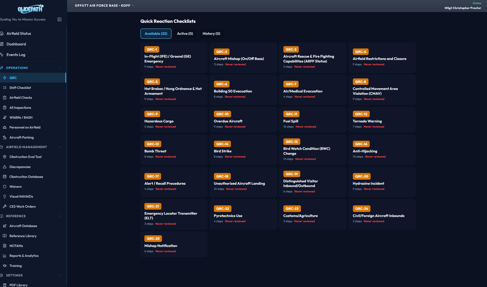

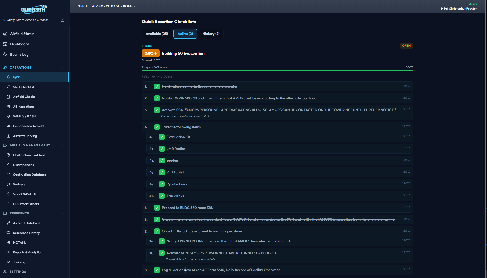

The QRC starts from the dashboard in two taps. It runs. It generates an Events Log entry at start and at completion. Every step response is timestamped. When the scenario is over, the PDF is ready for the CAT log.

---

## 8. Airfield Checks & Daily Inspections

Seven check types (FOD, RSC, IFE, Ground Emergency, Heavy Aircraft, BASH, RCR) plus daily airfield and lighting inspections with configurable per-base templates. Cross-device draft persistence — start the check on the inspector's tablet at the 08/26 threshold, resume it on the AMOPS desktop when weather drives them inside.

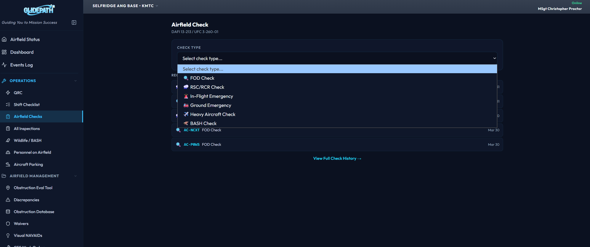

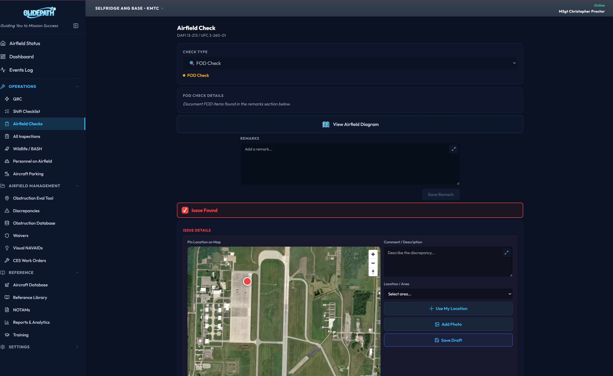

Default-to-pass toggle flow (pass → fail → N/A → pass), per-discrepancy photos, and one-per-day enforcement (hard lock on one airfield + one lighting inspection per day at the installation's 0600L reset time) prevent the "somebody else already filed today's check, mine is a duplicate" scenario that plagues paper and Excel systems.

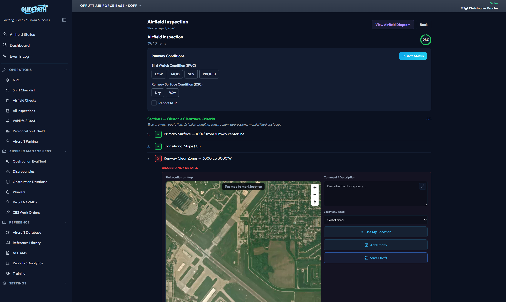

---

## 9. ACSI Annual Compliance Inspection

The full DAFMAN 13-204 Vol 2 Para 5.4.3 ACSI module — 10 sections, ~100 items, with risk certification signature blocks, inspection team attribution, filed-state lifecycle, and full PDF export formatted per AF standard. Draft save to database. Resume after a power outage. Reopen and rebuild the draft if something went wrong at staffing.

---

## 10. Wildlife / BASH

270+ species in the reference database (USFWS strike-risk weighted), sighting and strike forms with auto-populated weather (Open-Meteo API), species photos, a heatmap showing strike hotspots, and the BASH activity log.

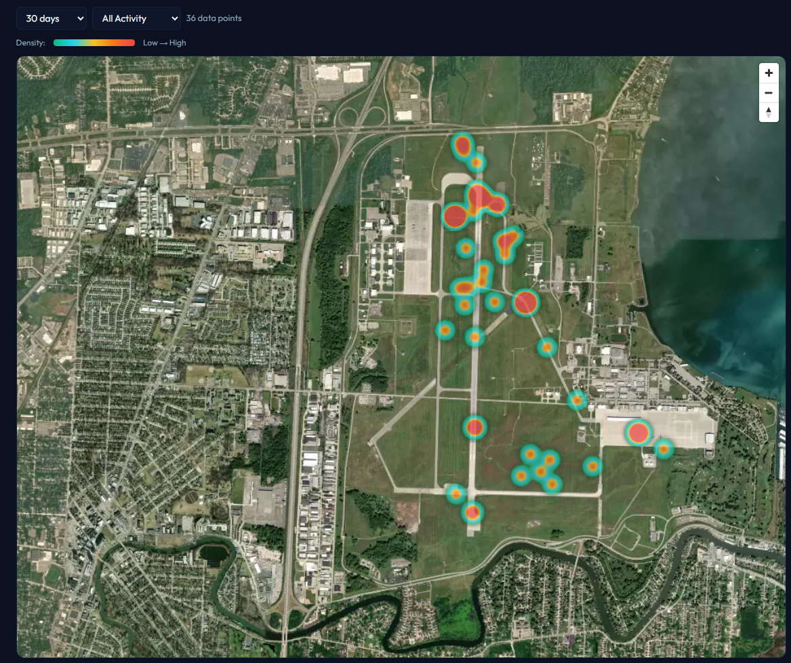

The heatmap is the artifact that wins the safety briefing. Where are we getting hit? When? Which species? The report pulls 30-day rollups straight from the sighting and strike database.

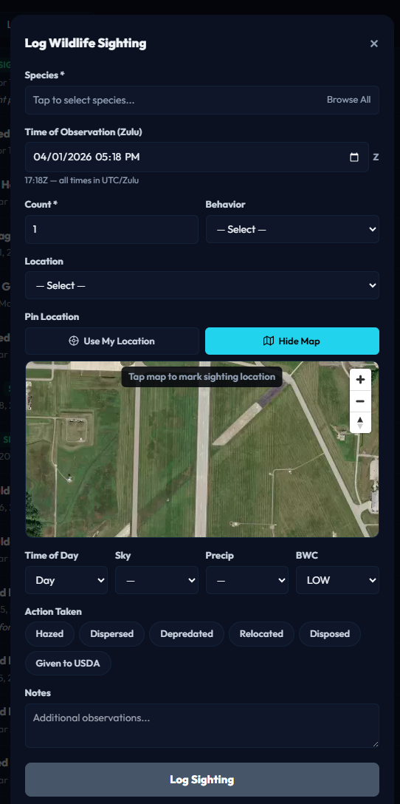

---

## 11. Obstruction Evaluations

UFC 3-260-01 imaginary surface geometry implemented in code. Drop a point with height AGL and distance from centerline; the system identifies which imaginary surfaces (Primary, Approach, Transitional, Horizontal, Conical, Inner) are violated and by how much. Taxiway OFA and Safety Area polygons render on the map. FAA TDG-based OFA and UFC Class A/B Clearance Lines both supported.

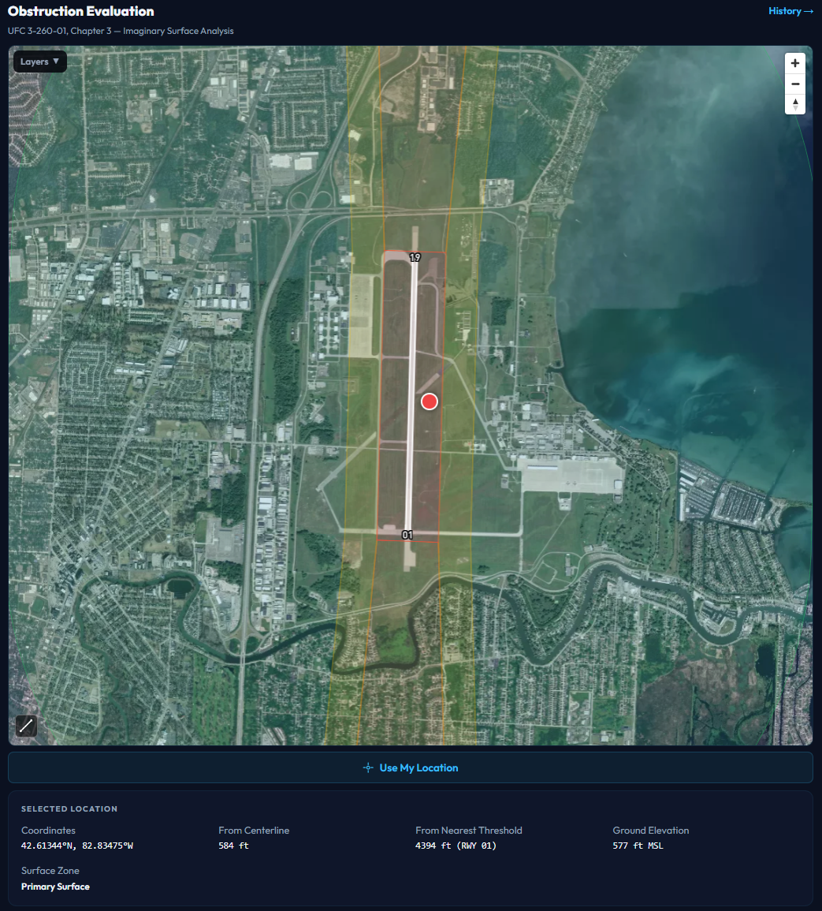

Every evaluation has a PDF output with the surface analysis, the violation geometry, and a satellite map thumbnail of the site.

---

## 12. Waivers

AF Form 505 implementation. Six classifications (Permanent, Temporary, Construction, Event, Extension, Amendment). Seven statuses with full lifecycle. Hazard rating, action requested, criteria source (UFC references), attachments (photos, site maps, risk assessments, UFC excerpts, FAA reports, coordination sheets). Multi-office coordination tracking (CE, AFM, Ops/TERPS, Safety, CC) with concur / non-concur per office. Annual review cadence.

PDF export of the active waiver, the annual review letter, and the staffing package. When the inspector is standing at the waiver location, the app shows the criteria source and the justification on their phone.

---

## 13. NOTAM Tracking

Live FAA NOTAM feed ingested via server-side sync (no CAC, no DINS login). Dropdown selectors for standard phraseology. Expiring NOTAMs warning. Hash-out against the legacy local NOTAM process is still in scope for v2.34.

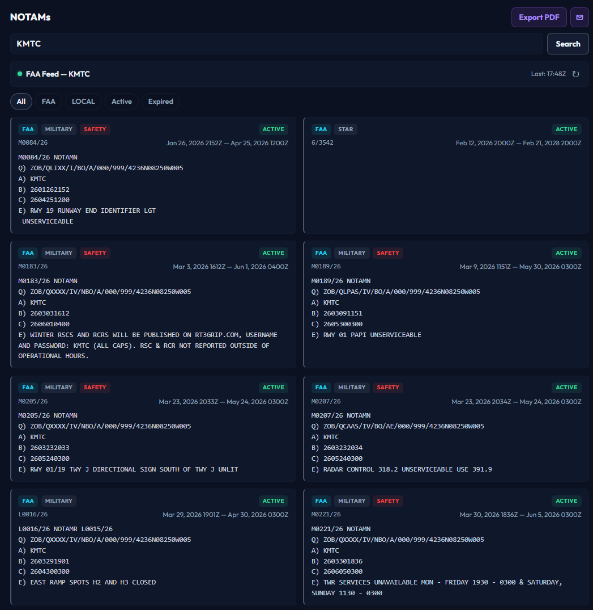

---

## 14. Shift Checklist & Events Log

DAFMAN-required shift turnover checklist with a 3-state toggle (complete / incomplete / N/A), installation-configurable reset time (default 0600L), and full history.

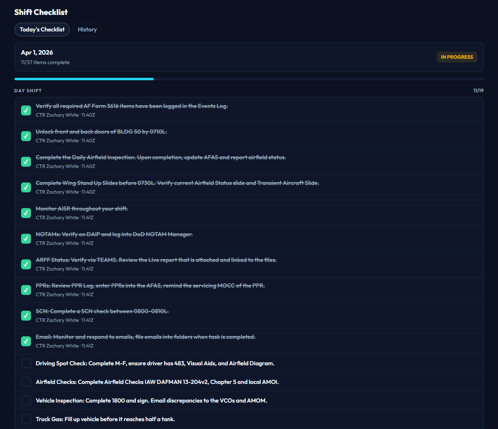

Every action in the app — a runway status change, a discrepancy created, a QRC started, a NAVAID marked inoperative, a PPR approved — writes to the Events Log with Zulu timestamp, action, entity, operating initials, and details. Click-to-reveal OI column. Edit and delete permissions are tightened: admins on all, owners on their own, hidden on synthetic entries.

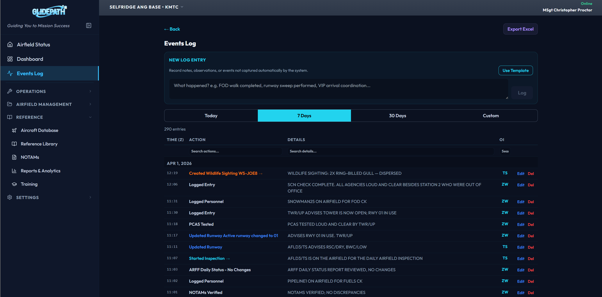

This is the AF Form 3616 substitute. A T-3 waiver is on file for the CAC-signature requirement, with authenticated user sessions + Zulu timestamps serving as the digital signature of record.

---

## 15. Reports & Analytics

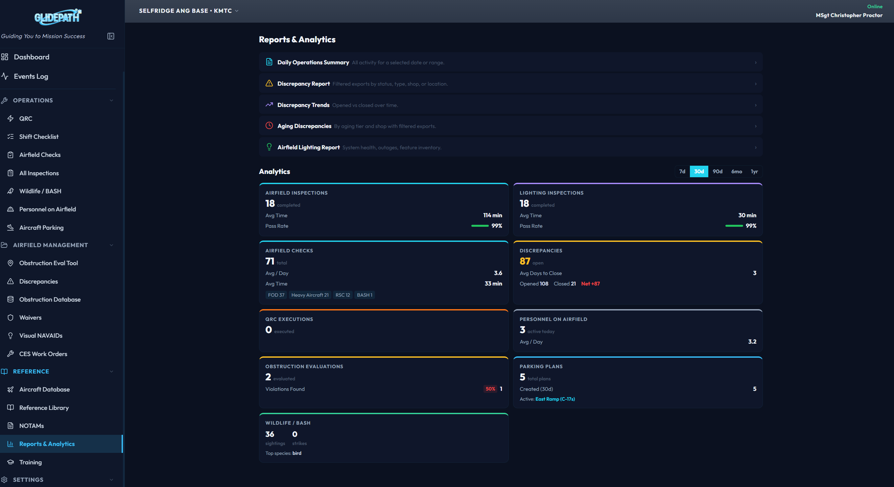

30-day analytics dashboard with inspection volume (split by type), check volume, discrepancy aging tiers, QRC frequency, personnel-on-airfield counts, obstruction evaluations, parking plans generated, wildlife activity. Configurable date range (custom window for CUI-free performance reporting to the Group).

**PDF reports available:**
- Daily Ops Report (signed daily package for the AFM binder)
- Discrepancy Aging Report (filter by status, type, shop, age)
- Open Discrepancies Report (configurable columns)
- Lighting Report
- Discrepancy Trends (30/60/90 day)

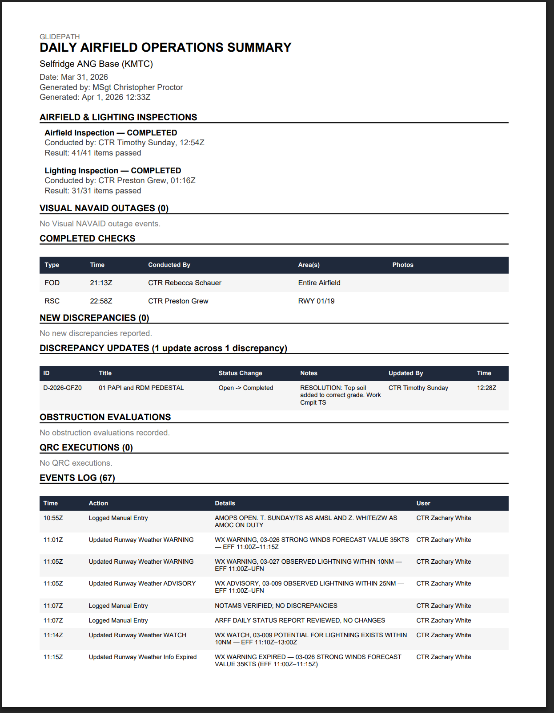

All client-side generated. No data leaves the browser. No third-party cloud touches the report content.

---

## 16. Multi-Base & Multi-Role

An AM professional who has permission at multiple bases (common for MAJCOM Functional Managers, IG inspectors, deploying teams) sees a base switcher in the header. One login, any base they have access to, fully isolated data per base via row-level security.

**Role hierarchy:**

- **Sys Admin** — Anthropic-style super-admin for the platform
- **Admin** — installation admin, can configure base setup, manage users
- **Airfield Manager** — full operational control
- **AMOPS** — full operational control except base setup
- **CES** — sees only CES Work Orders, Discrepancies (limited), Visual NAVAIDs (read), Settings. A dedicated landing page. No ability to create or delete discrepancies; can only update status from a constrained set (In Work, Project, Work Completed).
- **Viewer** — read-only

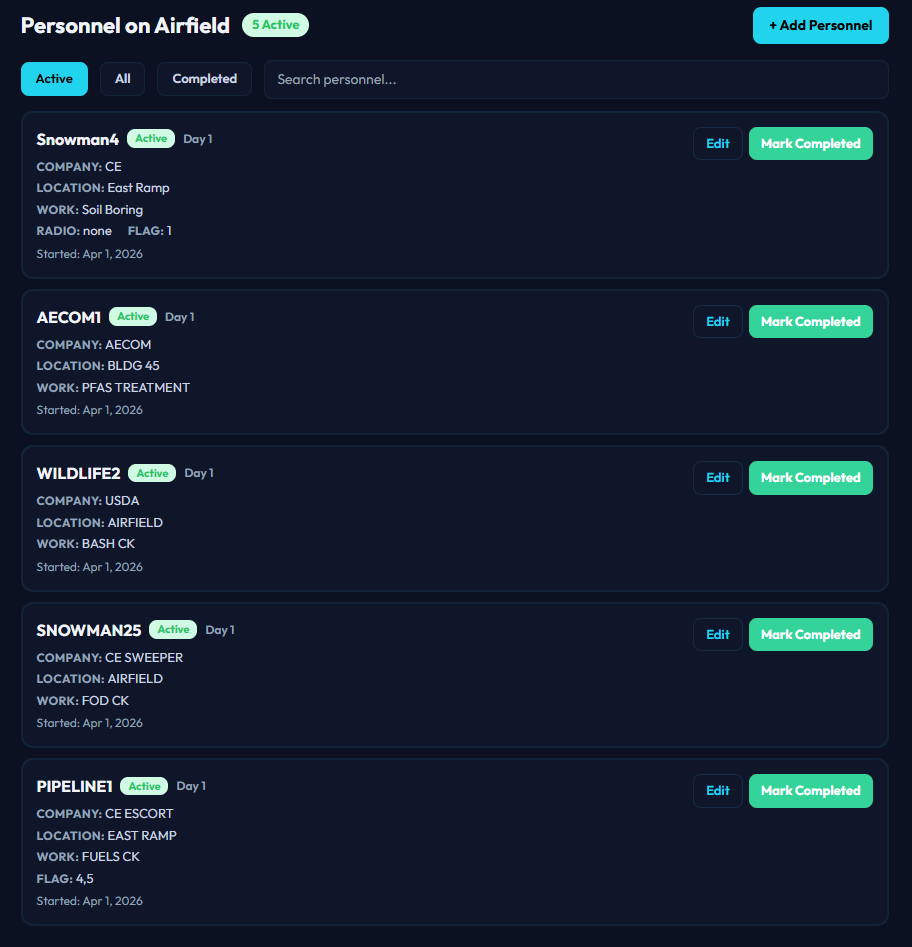

---

## 17. Glidepath vs. C2IMERA

Let's be honest about this comparison, because the working group's AAR is clear that C2IMERA is the Air Force's sanctioned enterprise C2 platform and adoption of it is a priority. Glidepath is not a replacement for C2IMERA. But it solves a different problem — and it solves it today, not in 24 months.

| Dimension | C2IMERA | Glidepath |
|---|---|---|
| **Purpose** | Enterprise C2 across all career fields; base-wide common operating picture | Daily operational tool specifically for Airfield Management |
| **Primary audience** | Wing CC, Command Post, multiple career fields | AFM, AMOPS, CES liaison, inspectors on the flight line |
| **Design approach** | General-purpose C2 → repurposed for AM | Built by and for the AM shop |
| **Adoption status** | Fielded at all active-duty bases; AAR acknowledges "inconsistent and ineffective use" | Production at Selfridge ANG; available for beta at any interested installation |
| **Change management burden** | High — the AAR explicitly identifies "overcoming user resistance" as critical | Low — the UX is designed around AM workflows, not retrofitted onto a C2 console |
| **Accessibility** | Installed client, typically CAC-gated | Any browser, any device, invite-based auth (CAC integration planned for P1 onboarding) |
| **Network posture** | NIPRNet enterprise | Commercial cloud today (Vercel + Supabase); Platform One IL4/IL5 migration planned |
| **Deployment friction** | Enterprise program of record; fielding coordinated through MAJCOM/PMO | URL + an invited account; beta testers onboarded in hours |
| **Real-time updates** | Refresh-based in most fielded configurations | Push-based via Supabase Realtime; sub-second propagation |
| **DAFMAN 13-204v2 outage engine** | Not implemented | Full Table A3.1 implementation with 4-tier alerts and bar-out detection |
| **UFC 3-260-01 imaginary surfaces** | Not implemented | Production |
| **ACSI module** | Not implemented | Full 10-section, ~100-item implementation |
| **Parking with wingtip clearance math** | Partial (visual layer only) | UFC-compliant clearance calculation live |
| **QRC engine with 8 step types** | Checklists supported at the start/complete level | Per-step response capture, time fields, conditionals, textareas, full PDF |
| **Wildlife / BASH module** | Not native | 270+ species DB, heatmap, weather auto-fill |
| **Waivers (AF Form 505)** | Not native | Full lifecycle with multi-office coordination |
| **PDF generation** | Server-side, enterprise integration | Client-side jsPDF, no data exfiltration |
| **Multi-base use** | Yes, via enterprise deployment | Yes, via per-user base permissions and switcher |
| **iOS/Android install** | Not a mobile app | PWA — installable to home screen on any OS |
| **Offline tile caching** | Varies | Service worker caches visited map regions |
| **Cost posture** | Program-of-record funded | SaaS model in development; government-use pricing TBD |

### Where They Complement Each Other

The C2IMERA Working Group's stated end state is a unified C2 platform that shows the wing CC *what is happening on the base*. That is a legitimate and important goal. But it is not the same goal as *giving the AM shop a tool they actually want to use every day*.

Glidepath is that tool. And because it generates clean, structured data (airfield status, discrepancies, NAVAID outages, inspections), it can *feed* C2IMERA via an integration layer. Glidepath is the shop's hands-on-keyboard tool; C2IMERA is the wing's glass-back-at-the-Command-Post view. They are complementary, not competitive.

The Phase 1 mandate in the C2IMERA AAR — "mandate usage of existing features via Guidance Memorandum" — is a legitimate short-term lever. But if the underlying UX friction is what is driving non-use, mandating use will produce compliance-theater, not situational awareness. Glidepath is what you mandate usage of when you want the shop to actually use it.

### Where C2IMERA Has the Advantage

- **Program of record.** Funded, staffed, and on the formal roadmap.
- **Authority to Operate.** Deployed on NIPRNet; integration with DAF enterprise systems (NexGen IT, AFAS, GDSS) is on the C2IMERA Phase 2 roadmap.
- **Cross-career-field reach.** C2IMERA is also used by Security Forces, Emergency Management, and Command Post. AM is one of several user communities.
- **Enterprise contracting.** Already procured. No new SaaS agreement required.

### Where Glidepath Has the Advantage

- **AM-native design.** Every workflow matches the DAFMAN cadence the AM shop already runs.
- **Built by an MSgt currently in the career field.** Feature requests are validated by doing the job.
- **Usable today.** Zero wait for Phase 2.
- **Full regulatory implementation.** DAFMAN 13-204v2 Vol 1–3, UFC 3-260-01, AFMAN 91-203, AFMAN 91-212, AF Forms 505/483/3616.
- **Real-time out of the box.** Every status change propagates in under a second.

---

## 18. Conservative Time-Savings Estimates

These numbers are deliberately conservative and based on observed workflow times at Selfridge ANG Base. Individual bases will vary.

| Task | Legacy Method | Glidepath | Time Saved (per instance) |
|---|---|---|---|
| Filing a discrepancy from the flight line | Note on paper → walk back → retype into spreadsheet → email CE (~15 min) | Tap on map, photo, submit (~90 sec) | **13 min** |
| Daily airfield inspection data entry | Paper inspection → transcribe to Excel → generate daily report (~45 min) | Inspect in-app → auto-filed → auto-report (~15 min) | **30 min** |
| Cross-referencing DAFMAN Table A3.1 for a NAVAID outage decision | Pull the PDF, find the system, walk through 4 thresholds (~20 min) | Automatic tier calculation + citation (<1 min) | **19 min** |
| Generating the Daily Ops Report | Compile Excel sheets, paste into Word, print/save (~30 min) | Click "Generate PDF" (<1 min) | **29 min** |
| Parking plan for a 6-aircraft incoming | Visio diagram, manual clearance check (~60 min) | Drag-place in Glidepath, auto-clearance validation (~10 min) | **50 min** |
| Shift turnover brief prep | Gather paper logs, reconcile what happened (~20 min) | Open Events Log, filter by shift window (~2 min) | **18 min** |
| ACSI discrepancy write-up | Paper ACSI → transcribe discrepancies → format per AF standard (~2 hrs) | Tap item → fail → write detail → auto-discrepancy created (~20 min) | **100 min** |
| Obstruction evaluation | Hand calculations against UFC imaginary surfaces, draw diagram (~90 min) | Drop point, auto-analysis, auto-PDF (~5 min) | **85 min** |
| Monthly wildlife summary for Safety | Compile strike/sighting data from Excel, generate charts (~3 hrs) | Analytics dashboard export (~5 min) | **175 min** |

**At a moderately-active 6-runway base with a 24/7 AM shop, an internal estimate from Selfridge AM Flight leadership is that Glidepath saves roughly 20–25 hours per AM shop member per month in administrative overhead.** Whether that time goes back to training, maintenance, or quality-of-life, the shop is getting it back.

---

## 19. Regulatory Alignment

| Reference | Module / Implementation |
|---|---|
| DAFMAN 13-204 Vol 1–3 | Airfield Status, Events Log, Shift Checklist, Inspections, Checks, Discrepancies, NOTAMs, PPR |
| DAFMAN 13-204 Vol 2 Table A3.1 | Visual NAVAID outage engine — 4-tier alerts, bar-out detection |
| DAFMAN 13-204 Vol 2 Para 5.4.3 | ACSI module — annual compliance inspection |
| DAFMAN 13-204 Vol 2 Para 2.5.2.10 | Web-based-program suitable-substitute authorization; T-3 waiver on file for Para 2.5.2.10.3/10.4 (CAC signature on AF Form 3616) |
| UFC 3-260-01 Ch. 3 | Obstruction Evaluations — geodesic imaginary-surface analysis |
| UFC 3-260-01 | Aircraft parking — wingtip / taxilane clearance envelopes |
| AFMAN 91-203 | QRC module — 25 emergency / contingency checklists |
| DAFMAN 91-212 | Wildlife / BASH module — sightings, strikes, heatmap |
| AF Form 505 | Waivers — 6 classifications, 7 statuses, full lifecycle |
| AF Form 483 | Contractors — escort credentials with expiry tracking |
| AF Form 3616 | Events Log (CAC-signature requirement waived via approved T-3) |

**AM Standardized Conditions Draft (AFFSA / 1C7)** — the mandatory conditions from the ACC/1C7 draft (Airfield Status, Active Runway, Runway Status, RSC, RCR, BWC, NAVAIDs, Airfield Lighting, ARFF) are all represented with the specified color codes and reporting groups in Glidepath's Airfield Status module.

---

## 20. How to Evaluate Glidepath

If you are a CMSgt in the AFM career field and you've read this far, you've already done the hard part. Here's how to take it further:

1. **See it live.** Open a browser to `https://airfield-app.vercel.app/login?demo=true` and you are in a fully-populated demo installation — Demo AFB, with 30 days of realistic data. No account required.

2. **Get a real account.** Email `info@glidepathops.com` with your name, rank, UIC, and installation. An isolated tenant for your base can be stood up in 24 hours. Invite 3–5 members of your shop. Let them run it in parallel with their current process for a week.

3. **Read the AAR compatibility analysis.** Section 17 above is that analysis in summary form. The full mapping of Glidepath features to the nine C2IMERA baseline requirements is in Section 1.

4. **Stress-test the NAVAID outage engine.** Pull a real Table A3.1 outage decision from your last year. Drop the same fixtures into Glidepath's Visual NAVAIDs module. Compare the tier, the cited rule, and the time-to-decision.

5. **Request a CMSgt walkthrough.** An author-led 30-minute video walkthrough is available on request. Built for CMSgts who need to brief their wing.

---

## Attribution

Glidepath is developed by an MSgt currently assigned to the 127th Wing at Selfridge ANG Base. The product is a personal-time effort; it is not an official USAF product. No endorsement by the Department of the Air Force is implied.

---

*This document reflects Glidepath version 2.33.0. It replaces `Glidepath_Capabilities_v2.32.md`. For the engineering-level SRS, see `Glidepath_SRS_v6.0_Developer.docx`.*
